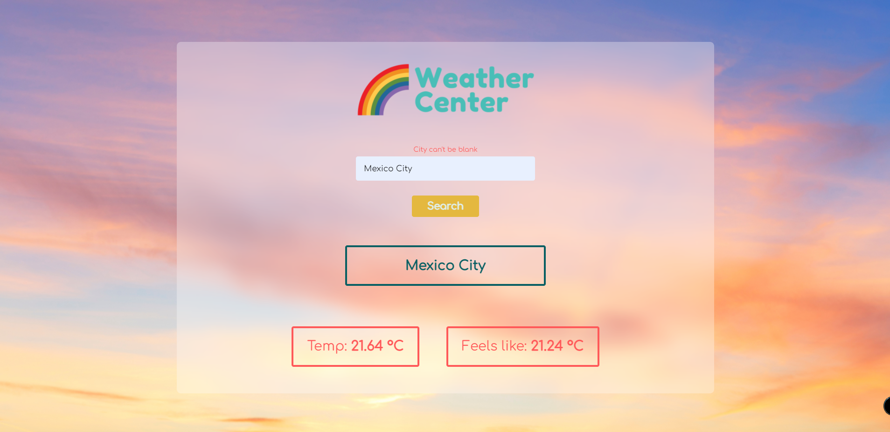

# JS-WeatherApp

> This is a simple Weather App made with Javascript, HTML & CSS, and the OpenWeather API. In the app, you will be able to search any city and see their temperatures in Celsius centigrades.
# Application Screenshot


## Built With

- HTML
- CSS
- Javascript
- Webpack
- OpenWeather API

## Getting Started

To get a local copy up and running follow these simple example steps:

- Clone this repository with:
```
  https://github.com/alexisbec/JS-WeatherApp.git
```
- Open the project folder where the repository was downloaded.
- Install all the Webpack dependencies:
```
  npm install
```
- Compile all the JS files:
```
  npm run build
```
- Open the *index.html* file with your live server.
- Fill the form with the city you want to see.
- Select the value that you want to see the centigrades (between Celsius or Farenheit).

## Prerequisites

- Web Browser
- Internet connection

## Author

👤 **Alexisbec**
- Github: [@alexisbec](https://github.com/alexisbec)
- Linkedin: [Alexis Varela](www.linkedin.com/in/alexbec)
- Twitter : [@AlexisV31667779](https://twitter.com/AlexisV31667779)


## 🤝 Contributing

Contributions, issues, and feature requests are welcome!

## Show your support

Give an ⭐️ if you like this project!

## 📝 License

This project is [MIT](https://github.com/alexisbec/JS-WeatherApp/blob/development/LICENSE) licensed.
